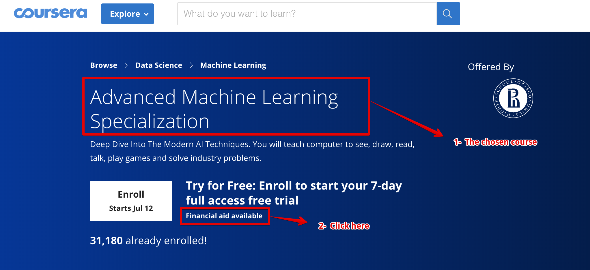
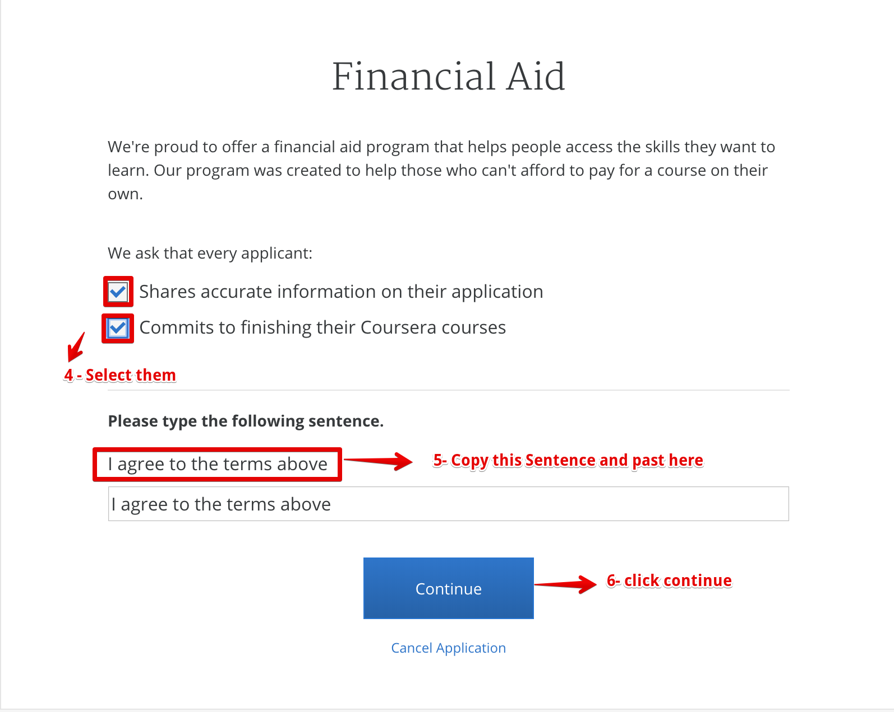
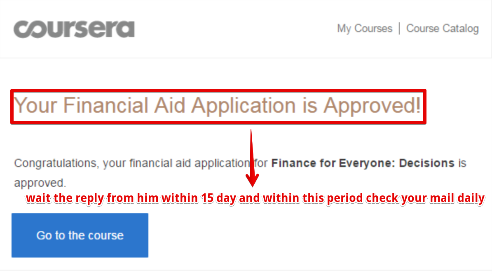

# Applying for financial aid on coursera 

## Everything between quotes you should change it 

## Why are you applying for Financial Aid? (150 words minimum required)
 I’m a student from India and want to learn Data Science. I think it will be beneficial for my work. But I’ve no job of my own to carry the expenses to pay for the certificate of this course. I live only for my scholarship, it is very much difficult for me to gather such amount of money for the certificate. Financial Aid will help me take this course without any adverse impact on my monthly essential needs. So I’m badly in need of this financial aid. I want to take this course as I want to learn. This course will boost my job prospects after graduation from my institute. It will help perform better in understanding and learning this technology and give me an edge over my competitors. A verified certificate will attach credibility to the certificate I receive from this course. I plan to complete all assignments on or before time as I have done in previous Signature Track Courses. Also, I intend to participate in Discussion Forums, which I have found to supplement my learning immensely in the other online courses I have taken on Coursera. I also plan to grade assignments that are to peer-reviewed which I believe will an invaluable learning opportunity.

## How will taking this course help you achieve your career goals? (150 words minimum required)
My main career goal is to learn every day. I really want to learn and to progress in my career. Programming requires constant learning and improving. Taking this course will help me to learn and study this Data Science and also to implement it. It can help me advance in my knowledge. This course will help me in defining Data Science, understanding how Python could potentially impact our business and industry, to write a thought leadership piece regarding use cases and industry potential of Data Science, explain Data Science to clients, friends, joining a community of economists, business leaders, entrepreneurs, and technologists that are shaping this technology as we speak. Identifying which aspects of Data Science seem most important and relevant to us, Walking away with a strong foundation in where Data Science is going, what it does, and how to prepare for it. Data Science course will help me achieve it to learn. Courses on Coursera helped me to greatly increase my programming knowledge in the past.

## If you answered no, please help us understand why.?
Because there are alot of developing countries the average rate of income is low and not enough personal needs for home so it isn't enough to get paid courses, and we need a lot of free courses for learning and improving ourselves and hlep the humanity and society.

Have some patience, to get this course.
It takes 15 days hardly…
